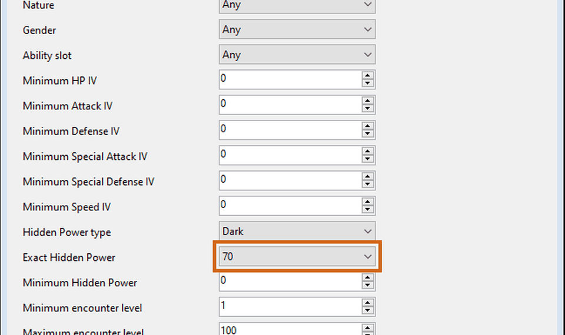
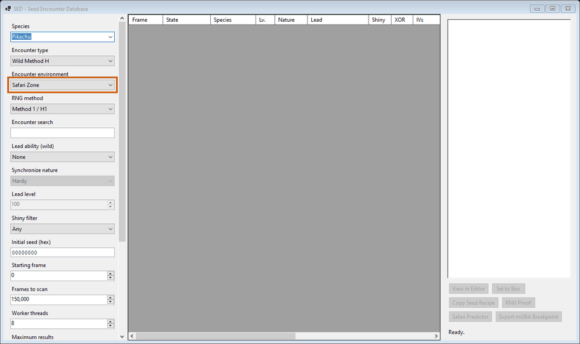

# sed

PKHeX plugin that reconstructs deterministic Generation III encounters from an initial RNG seed and an exact searchable frame range for reproducible manipulation workflows.

The interface resides under **Tools → Data → SED - Seed Encounter Database** and exposes deterministic filters for species environments methods shininess and frame constraints.

Parallel frame scanning evaluates Method H1 H2 and H4 correlations while reverse constraint solving preserves the exact originating frame for every reproducible result.

Independent Generation III shiny classification calculates the trainer shiny value locally, then requires PKHeX correlation agreement before accepting any constrained candidate.

Generated Pokémon inherit the loaded save trainer name TID SID language and gender because encounter conversion executes against the active PKHeX save context.

## Exact manipulation targets

Advanced filters solve exact Hidden Power type and base power combinations alongside PID IV nature gender ability level location encounter slot and frame constraints.

## Safari prediction

Safari results expose an offset scanner that reproduces Safari Ball shake calls and subsequent flee rolls from the post generation RNG state.

Ruby Sapphire and Emerald apply their fixed escape factor, while FireRed and LeafGreen use species specific flee rates derived directly from pret source tables.

## Manipulation workflow

Named manipulation presets persist complex filter configurations while the mGBA exporter emits RNG state watchpoints alongside generation breakpoints and automatic target savestates.

The exported Lua profiles identify every supported English Generation III ROM family then arm debugger callbacks around the selected state PID and encounter frame.

## Supported games

Every supported title has a matching public decompilation repository that documents the encounter generation and battle RNG semantics implemented by sed.

| Games | Source |
| --- | --- |
| Pokémon Ruby and Sapphire | [pret/pokeruby](https://github.com/pret/pokeruby) |
| Pokémon Emerald | [pret/pokeemerald](https://github.com/pret/pokeemerald) |
| Pokémon FireRed and LeafGreen | [pret/pokefirered](https://github.com/pret/pokefirered) |

## Installation

Download the [latest release](https://github.com/yardrack/sed/releases/latest) then place `sed.dll` inside the `plugins` directory beside `PKHeX.exe` before restarting PKHeX from Windows with deterministic plugin functionality enabled.

After loading a supported save, open the SED menu then select a species seed frame range encounter profile RNG method and manipulation policy.
